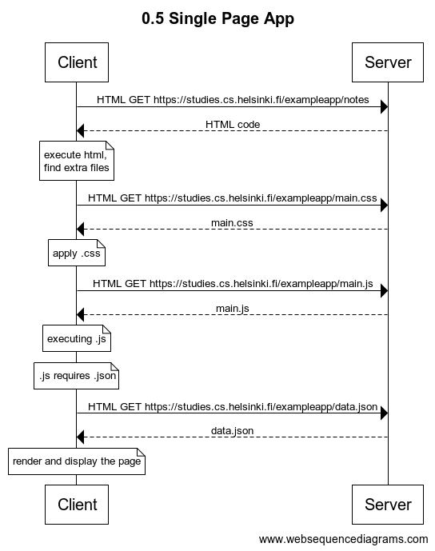

# Exercise 0.5 Single Page App

## Task

This exercise depicts a sequence of events, required for browser and server, to display updated simple web-page. 

User is asked to load [this dummy page](https://studies.cs.helsinki.fi/exampleapp/spa), provided by the University of Helsinki.

