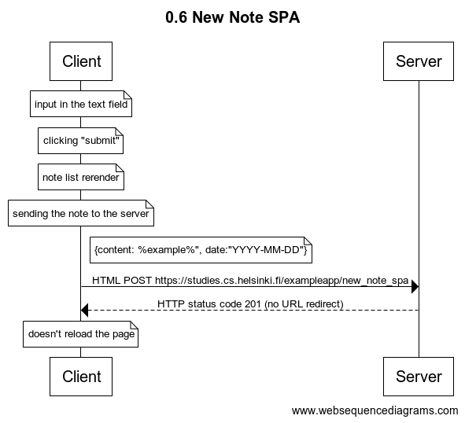

# Exercise 0.6 New Note SPA

## Task

This exercise depicts a sequence of events, required for browser and server, to update and display updated simple web-page, including new information. This method does include the AJAX and done in more modern manner.

User is asked to add a note at [this dummy page](https://studies.cs.helsinki.fi/exampleapp/notes), provided by the University of Helsinki.

